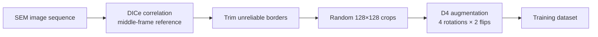

# Enhancing Localized Deformation Analysis with AI/ML

*Oregon State University, EECS Senior Capstone*

This GitHub organization hosts the repositories for an OSU Capstone research project that applies machine learning to localized deformation analysis in Scanning Electron Microscopy imagery. The full system spans automated ground-truth data generation, deep-learning displacement estimation, and safety-validated control of in-situ tensile testing hardware.

## Project Overview

Digital Image Correlation (DIC) is a widely used method for analyzing material deformation, but it requires careful parameter tuning and performs poorly on the low-contrast, noisy imagery typical of Scanning Electron Microscopy. Traditional DIC workflows depend on applied speckle patterns to assist correlation tracking, an approach that is often impractical at micro- and nano-scales.

This project applies a deep-learning approach to the conventional DIC workflow, predicting per-pixel displacement fields directly from raw SEM image pairs without speckle patterns. The end-to-end system feeds these predictions through a hardware safety wrapper to drive the Deben tensile stage, supporting feedback during in-situ materials testing.

## System Architecture


The system is organized into three subsystems:

- **DICe Pipeline** ([`dice-automation-tools`](https://github.com/OSU-Enhancing-Deformation-Analysis/dice-automation-tools)): Automates DICe-based ground-truth generation from SEM image sequences and prepares training tiles.
- **ML Model** ([`ML-Model`](https://github.com/OSU-Enhancing-Deformation-Analysis/ML-Model)): Predicts per-pixel displacement fields between SEM image pairs.
- **Deben Hardware Control** ([`Deban-API`](https://github.com/OSU-Enhancing-Deformation-Analysis/Deban-API)): Translates model predictions into validated motor commands for the Deben tensile stage.

A user-facing application ([`EnhancingDeformationAnalysisUI`](https://github.com/OSU-Enhancing-Deformation-Analysis/EnhancingDeformationAnalysisUI)) exposes the full pipeline to researchers running materials experiments.

## Key Capabilities

- **Per-pixel displacement ground truth from real SEM video**, with no applied speckle pattern required.
- **Deep-learning displacement prediction** trained on real microscopy data, for fast inference on new image pairs.
- **Safety-validated control of the Deben tensile stage**, with configurable load limits and emergency-stop enforcement before commands reach the vendor DLL.
- **A single desktop application** that takes a researcher from raw SEM images to displacement and strain fields.

---

## DICe Pipeline

The previous training pipeline relied on synthetic motion fields (described in [Project Structure](#project-structure) and [Technical Foundations](#technical-foundations) below). This year the team developed an automated DICe processing pipeline that generates real ground-truth displacement fields from SEM image sequences captured during actual tensile experiments.

A central challenge in this work was that DICe correlation collapses when comparing the first frame of a sequence against later frames containing accumulated deformation. Most subsets fail to correlate at all. Switching to a middle-frame reference strategy keeps correlation success consistently high across a wide range of frame intervals, while still producing displacement magnitudes large enough to be useful as ML training labels.

For each frame pair the pipeline trims unreliable border regions (DICe correlation degrades within `subset_size / 2` pixels of the image edge), crops random 128 × 128 tiles from the reliable interior, and applies **D4 symmetry augmentation** (four rotations combined with two horizontal-flip states) to balance the natural single-axis loading bias of tensile experiments.




> Schematic of the trim-and-tile sampling strategy. The unreliable border region (`subset_size / 2` wide on each side) is excluded from sampling; 128 × 128 training tiles are drawn from the reliable interior. The rows and columns shown are illustrative. In practice, tiles are sampled across the full interior region.


> Eight D4 augmentation variants of a single training tile. Each row shows the reference SEM crop, the deformed SEM crop, and the DICe-derived `dx` and `dy` displacement heatmaps. Rotations and flips swap and negate `dx` / `dy` consistently, enforcing rotation- and reflection-equivariance during training.

Tensile loading produces a strong directional bias in the raw displacement data; without augmentation a model trained on a single experiment would overfit to that one direction. The D4 group exposes the model to the same physical deformation viewed from eight orientations.

## ML Model

The team is moving from the original U-Net architecture (described in [Technical Foundations](#technical-foundations) below) to a RAFT-based optical-flow model trained on the new real-data tile dataset, with an upsample wrapper that lets the pretrained network operate on 128 × 128 input tiles.


> Preliminary output from the RAFT model on a representative SEM crack image. The top row shows the reference and deformed input frames. Panel 3 is the DICe ground-truth displacement field (sparse, populated only where DICe correlation succeeded). Panel 4 is the RAFT-predicted displacement (dense, covering the full field). Panel 5 is the residual error between the two. The model captures the overall pattern of deformation, but residual error remains substantial across the field. Training is ongoing.


> Validation loss over training, comparing two runs with identical model and hyperparameters, varying only the dataset. Without augmentation the model saturates relatively early. With D4 augmentation, validation loss continues to descend past where the un-augmented run plateaus and reaches a lower final value, demonstrating that augmentation prevents overfitting in addition to providing an absolute improvement.

## Hardware Safety Wrapper

The Deben safety wrapper sits between ML predictions and the vendor DLL, validating commands before they reach the hardware.

This project addresses the challenge of bridging multiple parts of the deformation analysis pipeline that do not naturally work together on their own. The Deban API repository describes its role as the middle layer between SEM and ML, transferring preprocessed data and using ML output for further processing. In practice, that means the system needs a reliable way to move from software side analysis to tester side control while keeping commands understandable, traceable, and safe. This matters because users in a research or engineering setting need more than a raw DLL wrapper or terminal workflow. They need a system that helps reduce unsafe commands, gives meaningful runtime feedback, and makes the integration path easier to understand and extend.

What makes this work notable is that it turns a low level command path into a more usable control layer. Instead of only exposing terminal driven interactions, the project now demonstrates a graphical interface that can load the Deben DLL, establish the software side connection, validate user commands against safe ranges, and record system responses. That makes the Deban API easier to demonstrate, easier to reason about, and more practical as a bridge between ML output and the Deben Microtest control environment. The broader organization also shows that this project lives inside a larger ecosystem of UI, ML, and analysis repositories, which makes the integration role especially important.

Its features include:

- **Graphical control panel for a hardware facing workflow.** Users can interact with the system through a GUI rather than only through a command line. The interface exposes important controls such as DLL loading, connection status, manual load entry, emergency stop, and an event log, making the workflow much easier to understand and present.
- **Safer command handling before execution.** The application checks load values before they are sent onward. For example, unsafe requests such as 1000 N are rejected by the interface rather than forwarded into the control path. This gives users a clearer and safer interaction model.
- **Visible system feedback during operation.** The interface reports useful state information such as whether the DLL loaded successfully, whether the software side connection was established, and whether a valid force reading is currently available. This is more informative than a silent failure or plain terminal output.
- **Runtime event logging for transparency.** User actions and system responses are recorded in the GUI log, including initialization, DLL load attempts, connection attempts, rejected unsafe commands, accepted commands, and emergency stop requests. This makes the system easier to debug and easier to demonstrate.
- **A clearer bridge between ML output and control software.** The repository defines the Deban API as a middleman between SEM and ML, handling transfer and preprocessing responsibilities between stages of the pipeline. The current GUI based prototype makes that bridging role easier to visualize and communicate.


Qt based Deban API control panel showing DLL loading, software side connection, safe load validation, manual command entry, emergency stop, and runtime event logging.

## Project Structure

> The following sections describe the project modules and technical foundations established in previous years. The 2025–2026 additions are described in the subsystem sections above.

### [Motion Vector Prediction Model](https://github.com/OSU-Enhancing-Deformation-Analysis/ML-Model)

This is the core machine learning model training setup for our project. This model predicts 2D motion vector fields between two input images. The primary goal is to learn the transformation that maps an initial image to a subsequent image. This is achieved by training a U-Net-like convolutional neural network with self-attention mechanisms. A key feature of this project is its sophisticated synthetic data generation pipeline, which generates diverse training samples by programmatically creating and combining vector fields, and using various geometric and procedural shapes to mask these fields.

The model is trained using PyTorch, and experiment tracking is managed with Weights & Biases (Wandb).

### [Displacement to strain calculation](https://github.com/OSU-Enhancing-Deformation-Analysis/displaceToStrain)

Once our model predicts motion displacement fields, we use this module to derive strain maps, which show how the material stretches, compresses, or shears across its surface.

This tool applies a Virtual Strain Gauge (VSG) technique to transform motion fields into a new set of strain tensors (XX, YY, XY) at each point in the image. These values give researchers a more meaningful understanding of how internal stresses are distributed throughout the material under examination.

<!-- Both of these repos are private, if you make them public then uncomment this.

### Crack Clustering Module

Crack-Clustering is an interactive toolkit for exploring crack patterns in SEM imagery. It slices or ingests whole JPEG images, extracts deep features with a ResNet-18 backbone, and automatically finds an optimal number of K-means clusters using elbow and silhouette analyses. Results are projected to 2-D with PCA and rendered in a Dash dashboard where each point links back to its full-resolution patch for rapid visual inspection. A single command launches the app, letting you switch between image-level and patch-level clustering, toggle green-outline preprocessing, and adjust patch size.

### Vector Field Generator Module

Vector-Field-Generator is a lightweight CLI utility that turns a single SEM micrograph, with a green-outlined crack, into an intuitive vector field that points away from the defect. The script segments the crack via HSV thresholding, fills the contour, computes a distance transform on the surrounding material, and derives unit-length gradients to visualize local "escape" directions. One command

```
python vector_field.py --image path/to/your_image.jpg

```

produces an annotated quiver plot, with adjustable arrow spacing and scale.

-->

### [Model Output Preview](https://github.com/OSU-Enhancing-Deformation-Analysis/Model-Output-Preview)

This project provides a small interface to test our machine learning models while we train them. This standalone interface allows us to visualize image sequences, motion vectors, and strain fields together in a clean, structured layout. This tool simplifies result inspection and enables researchers to compare raw inputs, machine-predicted motion, and derived strain in one place.

### [Crack detection algorithm](https://github.com/OSU-Enhancing-Deformation-Analysis/crack_detection)

As a preprocessing step, we built a crack detection system using the OpenCV library. This algorithm identifies and segments visible cracks in SEM imagery to help filter out regions that may distort strain calculations. By focusing only on intact regions, we make the predicted motion fields and resulting strain maps more accurate and physically meaningful.

### [Enhancing Deformation Analysis UI](https://github.com/OSU-Enhancing-Deformation-Analysis/EnhancingDeformationAnalysisUI)

This is the culmination of our work put into a single application that can be used to do material analysis. The application includes pages for loading, titling, and processing Scanning Electron Microscopy images, allowing a user to easily filter and section images for use later in the pipeline. They can then use these images as inputs to our machine learning models in the program to find the displacement and the strain of the material. The application also includes pages for viewing important statistical information about the images to find more interesting results with the sequence.

---

## Technical Foundations


> Examples of random motion fields generated in our synthetic dataset.

### The Model Architecture


> Our model architecture feeds grayscale images (left) transition through convolution and max pool stages to extract motion features. The self-attention stage correlates the motion across the image before decoding the motion using deconvolution and convolution stages to generate the per pixel X and Y displacement fields (right).

This Deep Neural Network is specifically designed to estimate the motion displacement between a pair of SEM images.

The architecture takes inspiration from the well-established **U-Net structure**, widely used in image segmentation and pixel-wise tasks. Recognizing the challenges of SEM image noise and the need to capture distant or sudden motion correlations in the material, we enhanced the U-Net with a **self-attention mechanism** in the bottleneck layer to allow the model to find correlations between the most important features in the motion.

### Model Output

The model takes a pair of grayscale SEM images at different times. It outputs an X and Y displacement field that maps each pixel location in the first image to its corresponding location in the second image.


> Real image sequence inputs and motion output from the model next to the traditional Digital Image Correlation displacement. The motion shows the two sides of the material moving apart.

### Synthetic Data

Without ground truth training data, we turn to synthetic data generation for training the model.

We start with a set of **17,000 motionless SEM material images**. Each training example includes an original SEM image and that same image with a known displacement applied. To generate the known displacement, we create a random combination of stacked motion fields and shape masks. This process is shown in Figure 3. Each motion field is selected from 14 functions types and modified by randomizing rotation, position, scale, and amplitude. The regions get masked by one of 19 shape masks, each also randomized in rotation, position, and scale. Finally, the combined **motion field is applied to the SEM image** and fed to the model as a pair. Each training example includes the original tile, the transformed tile, and the known displacement.


> A final motion field is generated using synthetic motion fields combined at random; then a shape mask is applied to the motion fields to create the final motion field. The final motion field is applied to an SEM image to generate a known displacement of the image.


### Training Example


---

## Getting Started

**System requirements:**
- DICe pipeline: Linux (tested on Ubuntu 22.04).
- Deben hardware wrapper: Windows (the vendor DLL is Windows-only).
- ML training: a CUDA-capable GPU is strongly recommended.

We recommend you start by using our [Enhancing Deformation Analysis UI](https://github.com/OSU-Enhancing-Deformation-Analysis/EnhancingDeformationAnalysisUI) to try using our machine learning models and other systems in an existing interface.

If you want to try training your own machine learning models based on another set of images, go to the [Motion Vector Prediction Model](https://github.com/OSU-Enhancing-Deformation-Analysis/ML-Model) repository to learn more about setting up your own project and using our training code.

## Team

### Current Team: CS.057 (2025–2026)

- **Yanghui Ren** ([renya@oregonstate.edu](mailto:renya@oregonstate.edu)): DICe automation pipeline, training data generation, model training infrastructure
- **Kyle Gemma** ([gemmak@oregonstate.edu](mailto:gemmak@oregonstate.edu)): Deben API safety wrapper, hardware control layer

### Project Partners

- **Brock Cloutier** ([cloutieb@oregonstate.edu](mailto:cloutieb@oregonstate.edu)): RAFT model training (OSU researcher)
- **Dr. Tianyi Chen** ([tianyi.chen@oregonstate.edu](mailto:tianyi.chen@oregonstate.edu)): Faculty advisor (Oregon State University)

This project builds on foundational work from a previous OSU EECS Capstone team, whose contributions are described in the [Project Structure](#project-structure) and [Technical Foundations](#technical-foundations) sections above.

## Acknowledgements

This project was made possible through the Oregon State University EECS Capstone program, with guidance from faculty who inspired this project and drove us to make some great progress.

The current team builds on foundational work by the previous OSU EECS Capstone team:

- Aidan Schmitigal
- Adam Henry
- Alex King
- Jaden Pearce
- Jason Lien
- Seiji Koenigsberg
